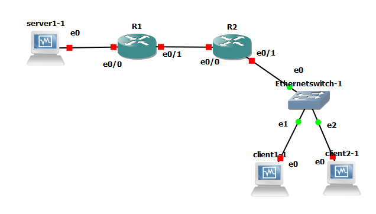

# TP 5 - Premier pas dans le monde Cisco

## I Préparation du lab



## II Lancement et configuration du lab

### Checklist IP VMs

#### Client 1

- [x] Désactiver SELinux (fait sur le patron)
- [x] Installation de certains paquets dans le patron (fait sur le patron)
- [x] Désactivation de la carte NAT (fait sur le patron)
- [x] Définition des IPs statiques
- [x] Connexion SSH
    * `ssh user@192.168.143.4`
- [x] Définition du nom de domaine
    * `[user@client1 ~]$ hostname --fqdn client1.tp5`
- [x] Remplissage du fichier /etc/hosts
    ```
    127.0.0.1   localhost localhost.localdomain localhost4 localhost4.localdomain4
    ::1         localhost localhost.localdomain localhost6 localhost6.localdomain6

    10.5.1.10 server1 server1.tp5
    10.5.2.11 client2 client2.tp5
    ```

#### Client 2
- [x] Désactiver SELinux (fait sur le patron)
- [x] Installation de certains paquets dans le patron (fait sur le patron)
- [x] Désactivation de la carte NAT (fait sur le patron)
- [x] Définition des IPs statiques
- [x] Connexion SSH
    * `ssh user@192.168.143.5`
- [x] Définition du nom de domaine
    * `[user@client2 ~]$ hostname --fqdn client2.tp5`
- [x] Remplissage du fichier /etc/hosts
    ```
    127.0.0.1   localhost localhost.localdomain localhost4 localhost4.localdomain4
    ::1         localhost localhost.localdomain localhost6 localhost6.localdomain6

    10.5.1.10 server1 server1.tp5
    10.5.2.10 client1 client1.tp5
    ```

#### Server 1

- [x] Désactiver SELinux (fait sur le patron)
- [x] Installation de certains paquets dans le patron (fait sur le patron)
- [x] Désactivation de la carte NAT (fait sur le patron)
- [x] Définition des IPs statiques
- [x] Connexion SSH
    * `ssh user@192.168.143.3`
- [x] Définition du nom de domaine
    * `[user@server1 ~]$ hostname --fqdn server1.tp5`
- [x] Remplissage du fichier /etc/hosts
    ```
    127.0.0.1   localhost localhost.localdomain localhost4 localhost4.localdomain4
    ::1         localhost localhost.localdomain localhost6 localhost6.localdomain6

    10.5.2.10 client1 client1.tp5
    10.5.2.11 client2 client2.tp5
    ```

### Checklist Routeurs

#### Routeur 1

- [x] Définitions des IPs statiques
    ```
    R1#show ip int br
    Interface                  IP-Address      OK? Method Status                Protocol
    Ethernet0/0                10.5.1.254      YES manual up                    up
    Ethernet0/1                10.5.3.1        YES manual up                    up
    Ethernet0/2                unassigned      YES unset  administratively down down
    Ethernet0/3                unassigned      YES unset  administratively down down
    ```
- [x] Définition du nom de domaine
    ```
    R1(config)#hostname Routeur1
    Routeur1(config)#
    ``` 

#### Routeur 2

- [x] Définitions des IPs statiques
    ```
    R2#show ip int br
    Interface                  IP-Address      OK? Method Status                Protocol
    Ethernet0/0                10.5.3.2        YES manual up                    up
    Ethernet0/1                10.5.2.254      YES manual up                    up
    Ethernet0/2                unassigned      YES unset  administratively down down
    Ethernet0/3                unassigned      YES unset  administratively down down
    ```
- [x] Définition du nom de domaine
    ```
    R2(config)#hostname Router2
    Router2(config)#    
    ``` 

### Checklist Route
* routeur1
    ```

        10.0.0.0/24 is subnetted, 3 subnets
    C       10.5.3.0 is directly connected, Ethernet0/1
    S       10.5.2.0 [1/0] via 10.5.3.2
    C       10.5.1.0 is directly connected, Ethernet0/0
    S*   0.0.0.0/0 [1/0] via 10.5.3.2
    ```

* routeur2
    ```
            10.0.0.0/24 is subnetted, 3 subnets
    C       10.5.3.0 is directly connected, Ethernet0/0
    C       10.5.2.0 is directly connected, Ethernet0/1
    S       10.5.1.0 [1/0] via 10.5.3.1
    S*   0.0.0.0/0 [1/0] via 10.5.3.1
    ```

* Client1