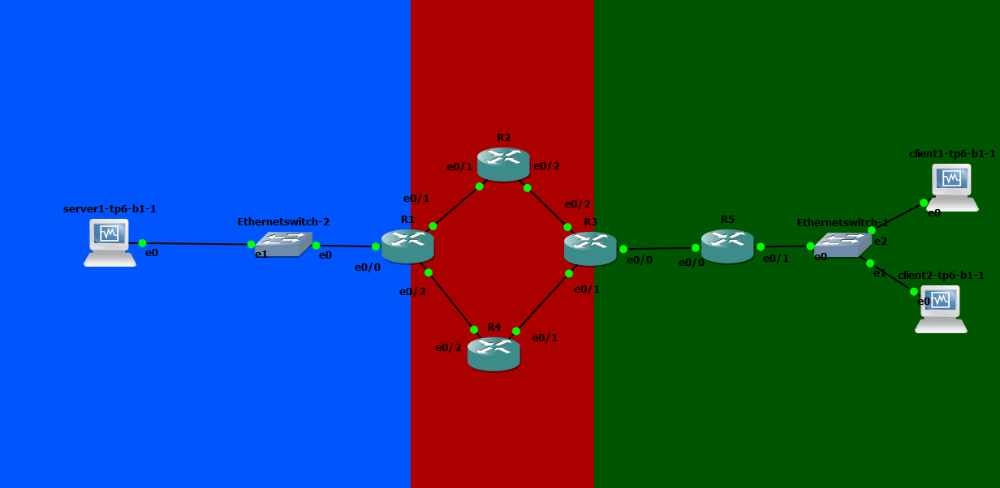

# TP 6 - Une topologie qui ressemble un peu à quelque chose, enfin ?

## Lab 1 : Simple OSPF

## Lab 2 : Un peu de complexité (et d'utilité ?...)

### 1. Présentation du lab et contexte



### 2. Mise en place du lab

#### Checklist IP Routeurs

* Routeur1 :
```
    R1#show ip int br
    Interface                  IP-Address      OK? Method Status                Protocol
    Ethernet0/0                10.6.202.254    YES manual up                    up
    Ethernet0/1                10.6.100.1      YES NVRAM  up                    up
    Ethernet0/2                10.6.100.5      YES NVRAM  up                    up
    Ethernet0/3                unassigned      YES NVRAM  administratively down down

```

* Routeur2 :
```
    R2#show ip int br
    Interface                  IP-Address      OK? Method Status                Protocol
    Ethernet0/0                unassigned      YES NVRAM  administratively down down
    Ethernet0/1                10.6.100.2      YES NVRAM  up                    up
    Ethernet0/2                10.6.100.9      YES NVRAM  up                    up
    Ethernet0/3                unassigned      YES NVRAM  administratively down down

```

* Routeur3 :
```
    R3#show ip int br
    Interface                  IP-Address      OK? Method Status                Protocol
    Ethernet0/0                10.6.101.1      YES NVRAM  up                    up
    Ethernet0/1                10.6.100.14     YES NVRAM  up                    up
    Ethernet0/2                10.6.100.10     YES NVRAM  up                    up
    Ethernet0/3                unassigned      YES NVRAM  administratively down down
```

* Routeur4 :
```
    R4#show ip int br
    Interface                  IP-Address      OK? Method Status                Protocol
    Ethernet0/0                unassigned      YES NVRAM  administratively down down
    Ethernet0/1                10.6.100.13     YES NVRAM  up                    up
    Ethernet0/2                10.6.100.6      YES NVRAM  up                    up
    Ethernet0/3                unassigned      YES NVRAM  administratively down down
```

* Routeur5 :
```
    R5#show ip int br
    Interface                  IP-Address      OK? Method Status                Protocol
    Ethernet0/0                10.6.101.2      YES NVRAM  up                    up
    Ethernet0/1                10.6.201.254    YES NVRAM  up                    up
    Ethernet0/2                unassigned      YES NVRAM  administratively down down
    Ethernet0/3                unassigned      YES NVRAM  administratively down down
```

#### Checklist VMs

* Client1 :
```
    2: enp0s3: <BROADCAST,MULTICAST,UP,LOWER_UP> mtu 1500 qdisc pfifo_fast state UP group default qlen 1000
        link/ether 08:00:27:ad:41:08 brd ff:ff:ff:ff:ff:ff
        inet 10.6.201.10/24 brd 10.6.201.255 scope global noprefixroute enp0s3
        valid_lft forever preferred_lft forever
        inet6 fe80::a00:27ff:fead:4108/64 scope link
        valid_lft forever preferred_lft forever
```

* Client2 :
```
    2: enp0s3: <BROADCAST,MULTICAST,UP,LOWER_UP> mtu 1500 qdisc pfifo_fast state UP group default qlen 1000
        link/ether 08:00:27:91:08:dd brd ff:ff:ff:ff:ff:ff
        inet 10.6.201.11/24 brd 10.6.201.255 scope global noprefixroute enp0s3
        valid_lft forever preferred_lft forever
        inet6 fe80::a00:27ff:fe91:8dd/64 scope link
        valid_lft forever preferred_lft forever
```

* Server1 :
```
    2: enp0s3: <BROADCAST,MULTICAST,UP,LOWER_UP> mtu 1500 qdisc pfifo_fast state UP group default qlen 1000
        link/ether 08:00:27:a0:8a:56 brd ff:ff:ff:ff:ff:ff
        inet 10.6.202.10/24 brd 10.6.202.255 scope global noprefixroute enp0s3
        valid_lft forever preferred_lft forever
        inet6 fe80::a00:27ff:fea0:8a56/64 scope link
        valid_lft forever preferred_lft forever
```

#### Configuration de OSPF

* Client1 ping server1 :
```
    [user@client1 ~]$ ping server1
    PING server1 (10.6.202.10) 56(84) bytes of data.
    64 bytes from server1 (10.6.202.10): icmp_seq=2 ttl=60 time=75.9 ms
    64 bytes from server1 (10.6.202.10): icmp_seq=3 ttl=60 time=71.1 ms
    64 bytes from server1 (10.6.202.10): icmp_seq=4 ttl=60 time=82.4 ms
    64 bytes from server1 (10.6.202.10): icmp_seq=5 ttl=60 time=76.4 ms
    ^C
    --- server1 ping statistics ---
    5 packets transmitted, 4 received, 20% packet loss, time 4010ms
    rtt min/avg/max/mdev = 71.127/76.494/82.454/4.033 ms
```

* Client2 ping server1 :
```
    [user@client2 ~]$ ping server1
    PING server1 (10.6.202.10) 56(84) bytes of data.
    64 bytes from server1 (10.6.202.10): icmp_seq=1 ttl=60 time=77.3 ms
    64 bytes from server1 (10.6.202.10): icmp_seq=2 ttl=60 time=87.1 ms
    64 bytes from server1 (10.6.202.10): icmp_seq=3 ttl=60 time=73.7 ms
    ^C
    --- server1 ping statistics ---
    3 packets transmitted, 3 received, 0% packet loss, time 2003ms
    rtt min/avg/max/mdev = 73.765/79.423/87.162/5.672 ms
```

* server1 ping client1 :
```
    [user@server1 ~]$ ping client1
    PING client1 (10.6.201.10) 56(84) bytes of data.
    64 bytes from client1 (10.6.201.10): icmp_seq=1 ttl=60 time=73.8 ms
    64 bytes from client1 (10.6.201.10): icmp_seq=2 ttl=60 time=69.7 ms
    64 bytes from client1 (10.6.201.10): icmp_seq=3 ttl=60 time=75.4 ms
    ^C
    --- client1 ping statistics ---
    3 packets transmitted, 3 received, 0% packet loss, time 2004ms
    rtt min/avg/max/mdev = 69.741/72.983/75.406/2.394 ms
```

* server1 ping client2 :
```
    [user@server1 ~]$ ping client2
    PING client2 (10.6.201.11) 56(84) bytes of data.
    64 bytes from client2 (10.6.201.11): icmp_seq=2 ttl=60 time=60.6 ms
    64 bytes from client2 (10.6.201.11): icmp_seq=3 ttl=60 time=76.5 ms
    64 bytes from client2 (10.6.201.11): icmp_seq=4 ttl=60 time=71.5 ms
    64 bytes from client2 (10.6.201.11): icmp_seq=5 ttl=60 time=76.8 ms
    ^C
    --- client2 ping statistics ---
    5 packets transmitted, 4 received, 20% packet loss, time 4007ms
    rtt min/avg/max/mdev = 60.663/71.416/76.894/6.570 ms
```

## Lab 3 : Let's end this properly

### 1. NAT : accès internet
#### ip interface
```
R4#show ip int br
Interface                  IP-Address      OK? Method Status                Protocol
Ethernet0/0                192.168.122.12  YES DHCP   up                    up
Ethernet0/1                10.6.100.13     YES NVRAM  up                    up
Ethernet0/2                10.6.100.6      YES NVRAM  up                    up
Ethernet0/3                unassigned      YES NVRAM  administratively down down
```

#### Route
```
R4#show ip route
Codes: C - connected, S - static, R - RIP, M - mobile, B - BGP
       D - EIGRP, EX - EIGRP external, O - OSPF, IA - OSPF inter area
       N1 - OSPF NSSA external type 1, N2 - OSPF NSSA external type 2
       E1 - OSPF external type 1, E2 - OSPF external type 2
       i - IS-IS, su - IS-IS summary, L1 - IS-IS level-1, L2 - IS-IS level-2
       ia - IS-IS inter area, * - candidate default, U - per-user static route
       o - ODR, P - periodic downloaded static route

Gateway of last resort is 192.168.122.1 to network 0.0.0.0

C    192.168.122.0/24 is directly connected, Ethernet0/0
     10.0.0.0/8 is variably subnetted, 7 subnets, 2 masks
O       10.6.100.8/30 [110/20] via 10.6.100.14, 00:20:22, Ethernet0/1
C       10.6.100.12/30 is directly connected, Ethernet0/1
O       10.6.100.0/30 [110/20] via 10.6.100.5, 00:20:22, Ethernet0/2
O       10.6.101.0/30 [110/20] via 10.6.100.14, 00:20:22, Ethernet0/1
C       10.6.100.4/30 is directly connected, Ethernet0/2
O IA    10.6.201.0/24 [110/30] via 10.6.100.14, 00:20:22, Ethernet0/1
O IA    10.6.202.0/24 [110/20] via 10.6.100.5, 00:20:24, Ethernet0/2
S*   0.0.0.0/0 [254/0] via 192.168.122.1
```

#### Ping google depuis R4
```
R4#ping 8.8.8.8

Type escape sequence to abort.
Sending 5, 100-byte ICMP Echos to 8.8.8.8, timeout is 2 seconds:
!!!!!
Success rate is 100 percent (5/5), round-trip min/avg/max = 32/103/148 ms
```

#### Ping google depuis client1
```
[user@client1 ~]$ ping 8.8.8.8
PING 8.8.8.8 (8.8.8.8) 56(84) bytes of data.
64 bytes from 8.8.8.8: icmp_seq=1 ttl=110 time=115 ms
64 bytes from 8.8.8.8: icmp_seq=2 ttl=110 time=90.9 ms
64 bytes from 8.8.8.8: icmp_seq=3 ttl=110 time=279 ms
64 bytes from 8.8.8.8: icmp_seq=4 ttl=110 time=158 ms
^C
--- 8.8.8.8 ping statistics ---
4 packets transmitted, 4 received, 0% packet loss, time 3005ms
rtt min/avg/max/mdev = 90.966/161.160/279.774/72.611 ms
```

#### Requête WEB sur un serveur web HTTP (trip-hop.net)

```
R1#telnet trip-hop.net 80
Translating "trip-hop.net"...domain server (8.8.8.8) [OK]
Trying trip-hop.net (213.186.33.4, 80)... Open

GET /
HTTP/1.0 400 Bad request
Cache-Control: no-cache
Connection: close
Content-Type: text/html

<html><body><h1>400 Bad request</h1>
                                    Your browser sent an invalid request.
                                                                         </body></html>

[Connection to trip-hop.net closed by foreign host]
```

On obtient pas l'HTML du site mais le serveur répond avec une erreur 400.

### 2. un service d'infra

On mets en place le server1 pour pouvoir le `curl` depuis le client1. Après la mise en place on `curl server1` depuis le client1 et l'on récupère de l'HTML.


### 3. Serveru DHCP

On défini la plage d'IP entre `10.6.201.50` et `10.6.201.70`.
On mets en place le serveur DHCP.
Après le test sur `client1.tp6.b1` son ip est maintenant `10.6.201.50`

```
    2: enp0s3: <BROADCAST,MULTICAST,UP,LOWER_UP> mtu 1500 qdisc pfifo_fast state UP group default qlen 1000
    link/ether 08:00:27:ad:41:08 brd ff:ff:ff:ff:ff:ff
    inet 10.6.201.50/24 brd 10.6.201.255 scope global noprefixroute dynamic enp0s3
       valid_lft 599sec preferred_lft 599sec
    inet 10.6.201.10/24 brd 10.6.201.255 scope global secondary noprefixroute enp0s3
       valid_lft forever preferred_lft forever
    inet6 fe80::a00:27ff:fead:4108/64 scope link
       valid_lft forever preferred_lft forever
```